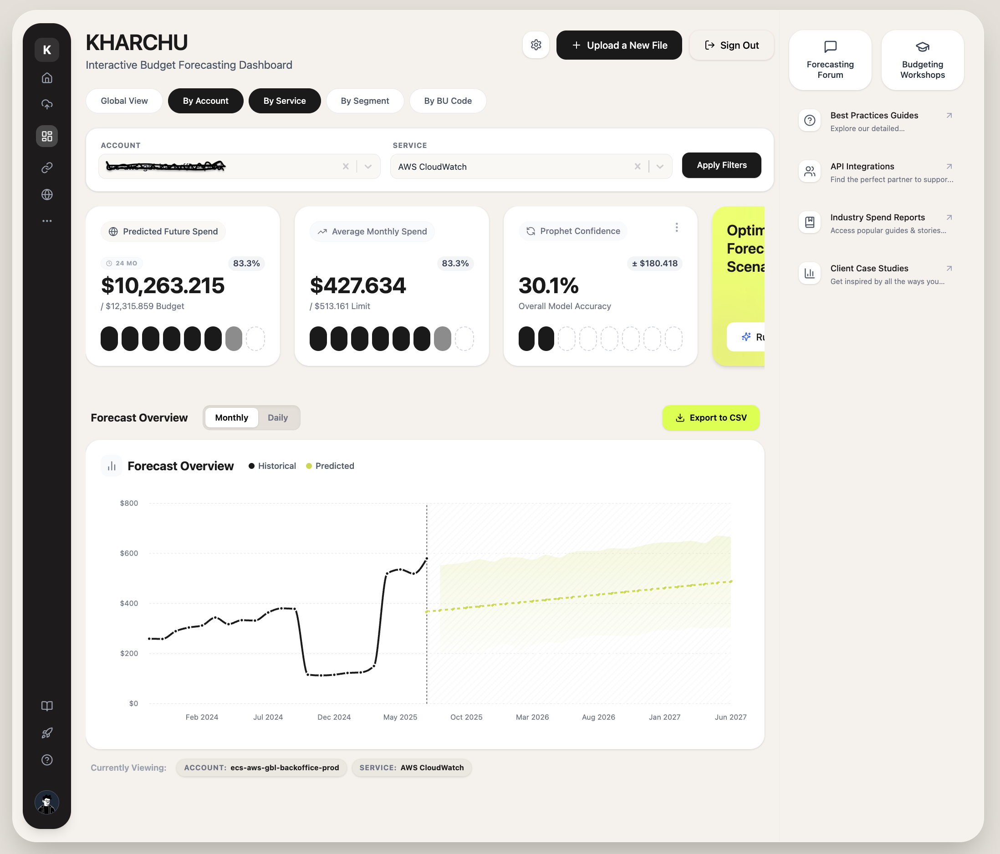

KHARCHU: Interactive Budget & Spend Forecasting Dashboard
=========================================================
<p align="center">
  
</p>
**Kharchu** is a full-stack, AI-powered financial application designed to ingest historical spend data and generate highly accurate future budget forecasts. By leveraging advanced Machine Learning algorithms (Facebook Prophet and CatBoost) running asynchronously via Celery, Kharchu provides organizations with a pristine, interactive dashboard to visualize and optimize their cloud and operational spend.

📑 Table of Contents
--------------------

1.  [Project Overview](https://www.google.com/search?q=#1-project-overview)
    
2.  [Core Features](https://www.google.com/search?q=#2-core-features)
    
3.  [System Architecture](https://www.google.com/search?q=#3-system-architecture)
    
4.  [Technology Stack](https://www.google.com/search?q=#4-technology-stack)
    
5.  [Repository Structure](https://www.google.com/search?q=#5-repository-structure)
    
6.  [Machine Learning Pipeline](https://www.google.com/search?q=#6-machine-learning-pipeline)
    
7.  [Local Development (Docker Recommended)](https://www.google.com/search?q=#7-local-development-docker)
    
8.  [Local Development (Manual Setup)](https://www.google.com/search?q=#8-local-development-manual)
    
9.  [API Documentation](https://www.google.com/search?q=#9-api-documentation)
    
10.  [Frontend Architecture](https://www.google.com/search?q=#10-frontend-architecture)
    

1\. Project Overview
--------------------

Managing and predicting enterprise spend—often referred to colloquially as "Kharchu" (expenses)—is notoriously difficult due to seasonal spikes, hidden costs, and changing business units.

This application solves that by allowing users to upload historical CSV spend reports. The backend instantly delegates the heavy lifting to a background Celery worker, which trains machine learning models to identify trends, seasonality, and outliers. Once complete, the user is presented with a beautiful, React-based dashboard featuring interactive charts and metrics.

2\. Core Features
-----------------

*   **🔐 Secure Authentication:** Full JWT-based authentication (Login/Signup) utilizing Django REST Framework SimpleJWT.
    
*   **📂 Asynchronous File Processing:** Upload large CSV files without blocking the UI. Background processing is handled gracefully by Celery and Redis.
    
*   **🧠 Ensemble ML Forecasting:** Combines Facebook Prophet (for time-series seasonality) and CatBoost (for complex categorical and gradient-boosted forecasting) to deliver enterprise-grade accuracy.
    
*   **📊 Interactive Analytics:** A premium, modern React UI built with TailwindCSS and Recharts, offering deep insights into historical vs. predicted spend.
    
*   **🐳 Fully Dockerized:** Seamless one-click local development and deployment environment.
    

3\. System Architecture
-----------------------
                                

The application follows a decoupled client-server architecture, communicating via a RESTful API.

**System Flow Explanation**

Client-Server Communication: The user interacts with the React Frontend (Vite). Whenever they upload a CSV or request data, the frontend communicates with the Django DRF Backend securely using JSON and JWTs via Axios.

Synchronous Data Storage: Standard relational data (like user accounts and metadata) is instantly read from or written to the PostgreSQL Database by Django.

Asynchronous Task Delegation: When a heavy Machine Learning job is triggered (like forecasting a new uploaded CSV), Django doesn't make the user wait. It instantly sends a message to the Redis Message Broker.

Background ML Processing: The Celery Worker continuously listens to Redis. It picks up the task and runs the complex Machine Learning Pipeline, passing the data through both the Prophet Model and the CatBoost Model to generate the ensemble forecast.

Real-time UI Updates: While Celery is crunching the numbers in the background, the React UI continuously polls the backend/task-status endpoint to check if the job is done, giving the user a smooth loading experience without freezing the browser.

4\. Technology Stack
--------------------

**Frontend (Client)**
---------------------

*   **Framework:** React 18 (Bootstrapped with Vite for instant HMR)
    
*   **Routing:** React Router DOM v6
    
*   **Styling:** Tailwind CSS
    
*   **Icons:** Lucide React
    
*   **Data Visualization:** Recharts
    
*   **HTTP Client:** Axios (with Interceptors for JWT attachment)
    

**Backend (API & Core Logic)**
------------------------------

*   **Framework:** Django 5.x & Django REST Framework (DRF)
    
*   **Authentication:** SimpleJWT (Access/Refresh Token strategy)
    
*   **Database:** PostgreSQL 15
    
*   **Task Queue:** Celery
    
*   **Broker / Cache:** Redis 7
    

**Machine Learning**
--------------------

*   **Time Series:** prophet (Facebook Prophet)
    
*   **Gradient Boosting:** catboost
    
*   **Data Manipulation:** pandas, numpy, scikit-learn
    

5\. Repository Structure
------------------------

Bash
```chatinput
budget_forecast_app/
│
├── budget_forecast_app/        # Core Django Project Settings
│   ├── settings.py             # DRF, CORS, Celery, and DB config
│   ├── urls.py                 # Main URL router (Auth endpoints live here)
│   └── celery.py               # Celery app initialization
│
├── forecast/                   # Main Django App
│   ├── views.py                # API endpoints (Register, Upload, Dashboard Data)
│   ├── urls.py                 # App-specific routing
│   ├── models.py               # PostgreSQL Schemas
│   ├── serializers.py          # DRF Serializers (User auth handling)
│   ├── tasks.py                # Asynchronous Celery Tasks (trigger_forecast)
│   │
│   └── ml/                     # Machine Learning Pipeline
│       ├── main.py             # Pipeline orchestrator
│       ├── prophet_model.py    # Prophet training and prediction logic
│       ├── utils/              # Data scaling, cleaning, and date transformations
│       └── models/             # Saved/Pickled ML models (.pkl, .cbm)
│
├── frontend/                   # React SPA
│   ├── src/
│   │   ├── components/         # Reusable UI (Hero, TopHeader, LeftSidebar)
│   │   ├── contexts/           # React Context (Theme, Auth)
│   │   ├── pages/              # Main Views (LandingPage, KharchuDashboard, AuthPage)
│   │   └── App.tsx             # React Router config & ProtectedRoutes
│   ├── package.json
│   └── tailwind.config.js      # Custom SaaS color palette configurations
│
├── docker-compose.yml          # Multi-container orchestration
├── Dockerfile                  # Django Backend image instructions
├── requirements.txt            # Python dependencies
└── manage.py                   # Django CLI


```


6\. Machine Learning Pipeline
-----------------------------

The ML pipeline resides in forecast/ml/ and is triggered via Celery to prevent HTTP timeouts during heavy training jobs.

1.  **Data Ingestion (data\_transformations.py):** Normalizes user-uploaded CSVs, handling missing values, standardizing date formats, and encoding categorical variables like "Business Unit" or "Region".
    
2.  **Prophet Execution (prophet\_model.py):** Best suited for identifying weekly, monthly, and yearly seasonal patterns in historical spend.
    
3.  **CatBoost Execution:** Used to capture complex, non-linear relationships between categorical features that Prophet might miss.
    
4.  **Ensemble Aggregation:** The results from both models are weighted and combined to produce a final, highly confident predicted\_spend array, which is then serialized and saved for the frontend dashboard to consume.
    

7\. Local Development (Docker Recommended)
------------------------------------------

The easiest way to run the entire stack (Postgres, Redis, Celery, Django, React) is via Docker Compose.

Prerequisites
-------------

*   [Docker Desktop](https://www.google.com/search?q=https://www.docker.com/products/docker-desktop/) installed and running.
    

Quick Start
-----------

1.  ```git clone https://github.com/your-org/budgetforecast.gitcd budgetforecast/budget\_forecast\_app```
    
2.  ```docker compose up --build```
    
3.  ```docker exec -it django-forecast-container python manage.py migrate```
    
    

Accessing the Services
----------------------

*   **React Frontend:** http://localhost:5173
    
*   **Django API Backend:** http://localhost:8000
    
*   **Postgres Database:** localhost:5433 (Mapped externally)
    

_Note: If you encounter CORS or Connection Refused errors on login, ensure your docker-compose.yml maps the Django container as - "8000:8000" and runs with the command python manage.py runserver 0.0.0.0:8000._

8\. Local Development (Manual Setup)
------------------------------------

If you prefer to run the application natively without Docker:

Backend Setup
-------------

1.  ```python -m venv venvsource venv/bin/activate # Windows: venv\\Scripts\\activatepip install -r requirements.txt```
    
2.  ```redis-server```
    
3.  ```python manage.py migratepython manage.py runserver```
    
4.  ```celery -A budget\_forecast\_app worker -l info```
    

Frontend Setup
--------------

1.  Bash`cd frontend`
    
2.  Bash`npm installnpm run dev`
    

9\. API Documentation
---------------------

Kharchu utilizes Django REST Framework. Authentication is required for all endpoints except register and token.

Include the following header in authenticated requests:Authorization: Bearer

Auth Endpoints
--------------

*   **POST /api/register/**: Create a new user account.
    
    *   _Body:_ {"email": "user@example.com", "password": "strongpassword", "name": "Jane Doe"}
        
*   **POST /api/token/**: Login to receive JWT tokens.
    
    *   _Body:_ {"username": "user@example.com", "password": "strongpassword"} (Note: simpleJWT requires the key "username" even if using an email).
        
*   **POST /api/token/refresh/**: Refresh an expired access token using the refresh token.
    

Forecast Endpoints
------------------

*   **POST /upload/**: Upload a historical spend CSV file. Returns a task\_id for background processing.
    
*   **GET /status//**: Poll the status of the Celery ML training job.
    
    *   _Returns:_ {"state": "PENDING" | "SUCCESS" | "FAILURE"}
        
*   **GET /api/dashboard-data/?task\_id=**: Fetches the processed historical data, Prophet confidence intervals, and future predictions for rendering in the React Dashboard.
    

10\. Frontend Architecture
--------------------------

The React frontend is designed with a strict "SaaS Dashboard" aesthetic.

Authentication Flow
-------------------

1.  User logs in via AuthPage.tsx.
    
2.  access\_token and refresh\_token are saved to localStorage.
    
3.  The App.tsx router wraps private pages (KharchuDashboard, UploadPage) in a component. Unauthenticated users are instantly bounced to /login.
    
4.  TopHeader.tsx and Header.tsx dynamically check localStorage to display either a "Login/Signup" button or a "Sign Out" button.
    

Axios Interceptors (Recommended Pattern)
----------------------------------------

To avoid attaching the JWT manually to every API call, configure an Axios interceptor in App.tsx:


🤝 Contributing
---------------

1.  Fork the Project
    
2.  Create your Feature Branch (git checkout -b feature/AmazingFeature)
    
3.  Commit your Changes (git commit -m 'Add some AmazingFeature')
    
4.  Push to the Branch (git push origin feature/AmazingFeature)
    
5.  Open a Pull Request
    

📝 License
----------

Distributed under the MIT License. See LICENSE for more information.
